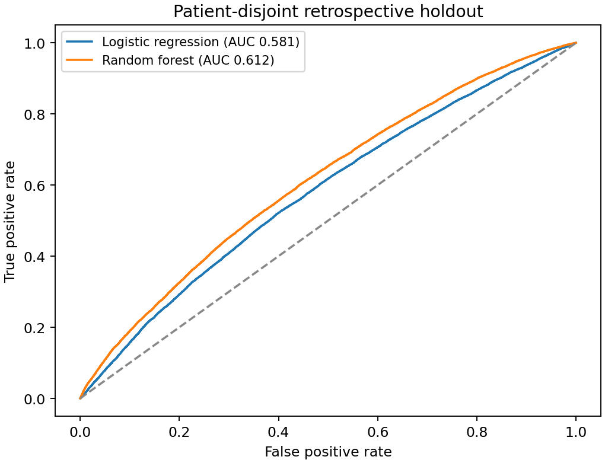

# Methods and interpretation

## Question

How well do demographics, laboratory measurements, and recorded vital signs classify ICU stays lasting at least two days?

## Data

94,444 ICU stays. Requires credentialed MIMIC-IV access and a locally prepared cohort. Keep the cohort and any fitted models outside the public repository. The extraction notebook documents the original MIMIC-IV 3.1 queries; it does not repair the feature-time limitations above. BigQuery execution can incur charges.

## Analysis

I built the cohort in BigQuery and evaluated logistic regression and random forest on a patient-grouped holdout. The features include demographics, laboratory measurements joined at the patient level, and the earliest recorded vital sign within each ICU stay.

The entry point is `train.py`. Parameters, variables, assumptions, and analysis cohorts are recorded in the code and generated result files.

## Findings

In a revised patient-grouped holdout, random forest ROC-AUC was 0.612 and logistic regression ROC-AUC was 0.581. The test set contained 47,151 stays from 32,678 patients. These are new fixed-parameter benchmarks, not the original tuned-model results.

_ROC curves from the revised patient-grouped retrospective holdout._

## Assumptions and interpretation

This is retrospective classification, not admission-time prediction. Vital signs are the earliest recorded anywhere in the ICU stay, while laboratory measurements have no bounded lookback and are joined by patient rather than admission. No external or temporal validation was performed.

## Result files

- [cohort-audit.json](results/cohort-audit.json)
- [grouped-holdout-metrics.csv](results/grouped-holdout-metrics.csv)
- [grouped-holdout-roc.png](results/grouped-holdout-roc.png)
Source context: [https://physionet.org/content/mimiciv/](https://physionet.org/content/mimiciv/)

